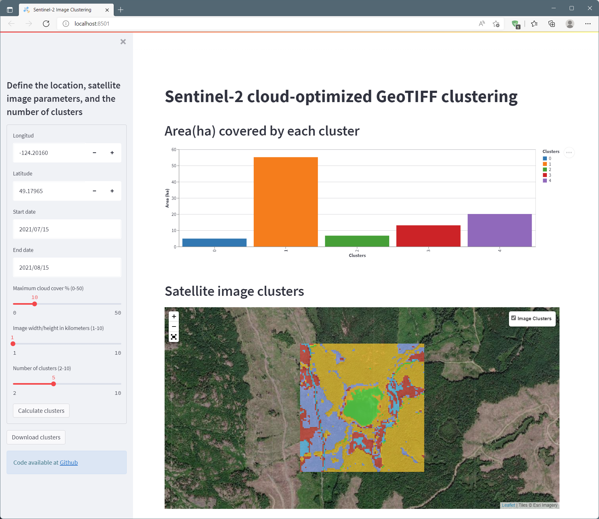

# Sentinel-2 cloud-optimized GeoTIFF clustering
## Contents
1. [Introduction](#1-introduction)
2. [Installation](#2-installation)
3. [Usage](#3-usage)
4. [Conclusions](#4-conclusions)

### 1. Introduction
Until recently, satellite image processing required to locally store these datasets for performing any pre-processing or analyses. Nowadays, recent advances in streaming protocols for geospatial information, in particular cloud-optimized GeoTIFFs ([COG](https://www.cogeo.org/)), and specifications for indexing and discovering geospatial datasets such as the SpatioTemporal Asset Catalog ([STAC](https://stacspec.org/)) specification, have created a new paradigm in remote sensing for data retrieval, processing, and analysis, where one can process satellite imagery on-premises or in the cloud, without downloading these massive datasets.

This repository contains an example of how to perform a cluster analysis (i.e. unsupervised classification) on a Sentinel-2 satellite image, using its fours 10-m spatial resolution bands. The algorithm used was [k-means](https://en.wikipedia.org/wiki/K-means_clustering) and the clusters can be generated anywhere in the world where there is availability of Sentinel-2 imagery. The imagery is searched and retrieved from a public AWS catalog, the clusters are calculated and a bar chart and a map show these results in the app interface.

### 2. Installation
A `conda` environment was created, and the following Python libraries were installed using the command `conda env create -f environment.yml`:
- streamlit
- streamlit_folium
- folium
- pystac_client
- rasterio
- numpy
- pandas
- matplotlib
- altair
- scikit-learn

### 3. Usage
Once the conda environment was create and activated, use the terminal to execute the command `streamlit run code/st_kmeans_app.py`.

The Streamlit app contains two main elements, the sidebar on the left and the results area on the right. On the sidebar the user must specify the following parameters:
- Longitude:            central longitude of the area of interest, expressed in decimal degrees
- Latitude:             central latitude of the area of interest, expressed in decimal degrees
- Start date:           satellite image start acquisition date   
- End date:             satellite image end acquisition date
- Maximum cloud cover:  maximum cloud cover, expressed as percentage
- Image width/height:   size of the area of interest, expressed in kilometers
- Number of clusters:   desired number of clusters

Once all the parameters have been specified, clicking on the `Calculate clusters` button will generate on the results area, a bar chart showing the area (in hectares) covered by each cluster, and a map where the user can turn on and off the clusters to compare them with the underlying satellite imagery.

Finally, if desired, the user can download a GeoTIFF for further processing (e.g. QGIS). For downloading the clusters' GeoTIFF the user must click on the button called `Download clusters`.

### 4. Conclusions
Several random locations were tested during the creation of this app, and the results shown were visually accurate. The usefulness of this algorithm lies on there is no need to train the satellite image to generate a fast land cover map to help one understands  the landscape under study. It is worth mentioning the satellite background shown in the map widget is not the original Sentinel-2 image used for calculating the clusters. This decision was taken to avoid using too many computing resources, but in a larger scale production environment this can easily be modified.

The code provided in this repository can be used as a starting point for developing analysis and visualization tools that make use of relatively new technologies for the search, retrieval, and analysis of satellite imagery, specifically COGs and the STAC specification.

I you need more information, feel free to [contact me](https://twitter.com/julionovoa_).